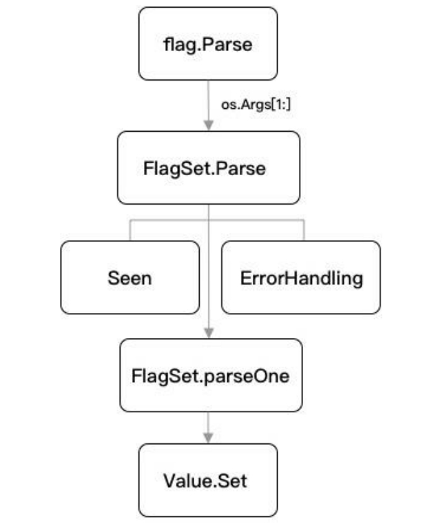

## 获取命令行参数

```go
// os.Args demo
func main() {
	// os.Args 是一个 []string
	// 参数以空格分割
	if len(os.Args) > 0 {
		for index, arg := range os.Args {
			fmt.Printf("args[%d]=%v\n", index, arg)
		}
	}
}
```

- `os.Args[0]` 是程序名
- `os.Args[1:]` 是命令行参数


## 命令行参数类型

flag 包支持的命令行参数类型有 bool、int、int64、uint、uint64、float float64、string、duration。

## 定义命令行参数

有以下两种常用的定义命令行 flag 参数的方法。

### flag.Type()

```go
func main() {
	uid := flag.Int("uid", 1, "ID")
	log := flag.String("log", "20200719", "Log")
	admin:= flag.Bool("admin", false, "Admin")
	delay := flag.Duration("d", 0, "Duration")
}
```

### flag.TypeVar()

```go
	var(
		uid int
		log string
		admin bool
		delay time.Duration
	)
	flag.IntVar(&uid, "uid", 1, "ID")
	flag.StringVar(&log, "log", "20200719", "Log")
	flag.BoolVar(&admin, "admin", false, "Admin")
	flag.DurationVar(&delay, "delay", 0, "Duration")
```

## 解析命令行参数

通过以上两种方法定义好命令行 flag 参数后，需要通过调用 `flag.Parse()` 来对命令行参数进行解析。

支持的命令行参数格式有以下几种：

- `-flag xxx` （空格，一个 `-` 符号）仅支持布尔类型。
- `--flag xxx` （空格，两个 `-` 符号）仅支持非布尔类型。
- `-flag=xxx` （等号，一个 `-` 符号）都支持。
- `--flag=xxx` （等号，两个 `-` 符号）都支持。

非布尔类型的参数必须使用等号的方式指定。

Flag 解析在第一个非 flag 参数之前停止，或者在终止符 `-` 之后停止。

## flag 中的其他函数

- flag.Args() 返回命令行参数后的其他参数，[]string 类型
- flag.NArg() 返回命令行参数后的其他参数个数
- flag.NFlag() 返回使用的命令行参数个数

```go
func main() {
	var x, y, z int
	flag.IntVar(&x, "x", 1, "x")
	flag.IntVar(&y, "y", 2, "y")
	flag.IntVar(&z, "z", 3, "z")

	flag.Parse()

	fmt.Println(os.Args)
	fmt.Println(x, y, z)
	// 不带 -flag 的参数
	fmt.Println(flag.Args())
	// 不带 -flag 的参数个数
	fmt.Println(flag.NArg())
	// 带 -flag 的参数个数
	fmt.Println(flag.NFlag())
}
```

```powershell
> go run main.go -x 1 -y 2 -z 3 4 5
[main.exe -x 1 -y 2 -z 3 4 5]
1 2 3
[4 5]
2
3
```

## 子命令

一个工具可能包含了大量相关联的功能命令，以此形成工具集。

```go
var n string

func main() {
	flag.Parse()

	// 该方法会返回带有指定名称和错误处理属性的空命令集
	// 相当于创建一个新的命令集去支持子命令
	kitCmd := flag.NewFlagSet("kit", flag.ExitOnError)
	kitCmd.StringVar(&n, "n", "value", "help")

	// 不带 -flag 的参数
	args := flag.Args()
	switch args[0] {
	case "kit":
		_ = kitCmd.Parse(args[1:])
	}
	log.Println("n =", n)
}
```

## 命令行解析流程



1. flag.Parse

在所有命令行参数注册的最后进行调用，其功能是解析并绑定命令行参数。

```go
// CommandLine is the default set of command-line flags, parsed from os.Args.
// The top-level functions such as BoolVar, Arg, and so on are wrappers for the
// methods of CommandLine.
var CommandLine = NewFlagSet(os.Args[0], ExitOnError)

// Parse parses the command-line flags from os.Args[1:]. Must be called
// after all flags are defined and before flags are accessed by the program.
func Parse() {
	// Ignore errors; CommandLine is set for ExitOnError.
	CommandLine.Parse(os.Args[1:])
}
```

`Parse` 方法调用 `NewFlagSet` 方法实例化了一个新的空命令集，然后通过调用 `os.Args` 把新的空命令集作为外部参数传入。

Parse 方法使用的是 CommandLine 变量，它默认传入的 ErrorHandling 是ExitOnError。也就是说，如果在解析时遇到异常或错误，就会直接退出程序。如果不希望只要应用程序解析命令行参数失败，就导致应用启动中断，则需要进行额外的处理。

2. FlagSet.Parse

FlagSet.Parse 是对解析方法的进一步封装，实际上解析逻辑放在了parseOne 中，而解析过程中遇到的一些特殊情况，如重复解析、异常处理等，均直接由 FlagSet.Parse 进行处理。

3. FlagSet.parseOne

FlagSet.parseOne 是命令行解析的核心方法，所有的命令最后都会流转到  FlagSet.parseOne 中进行处理。

在定位命令行参数节点上，采用的依据是根据“-”的索引定位解析出上下参数名和参数值。

在设置参数值时，会对值类型进行判断。若是布尔类型，则调用定制的 boolFlag 类型进行判断和处理。最后，通过该 flag 提供的 Value.Set 方法将参数值设置到对应的 flag 中。

## 定义参数类型

flag 的命令行参数类型是可以自定义的。也就是说，在 Value.Set 方法中，我们只需实现其对应的 Value 相关的两个接口就可以了。

```go
type Value interface {
	String() string
	Set(string) error
}
```
